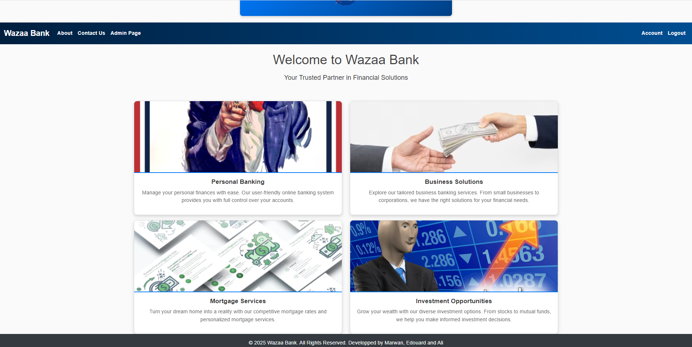
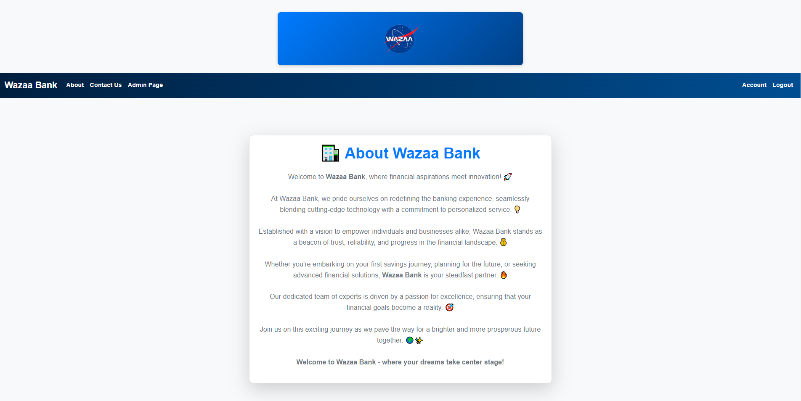
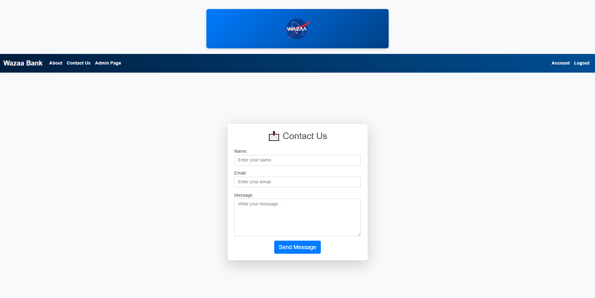
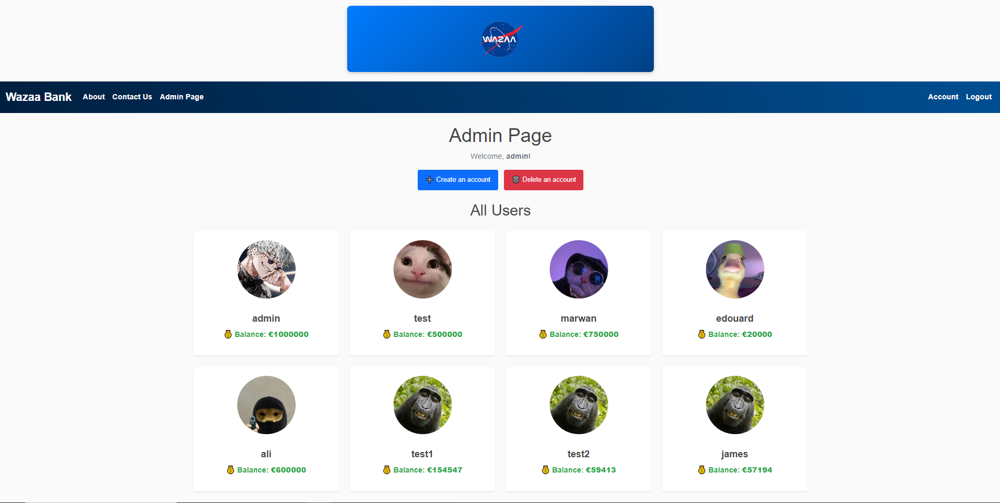
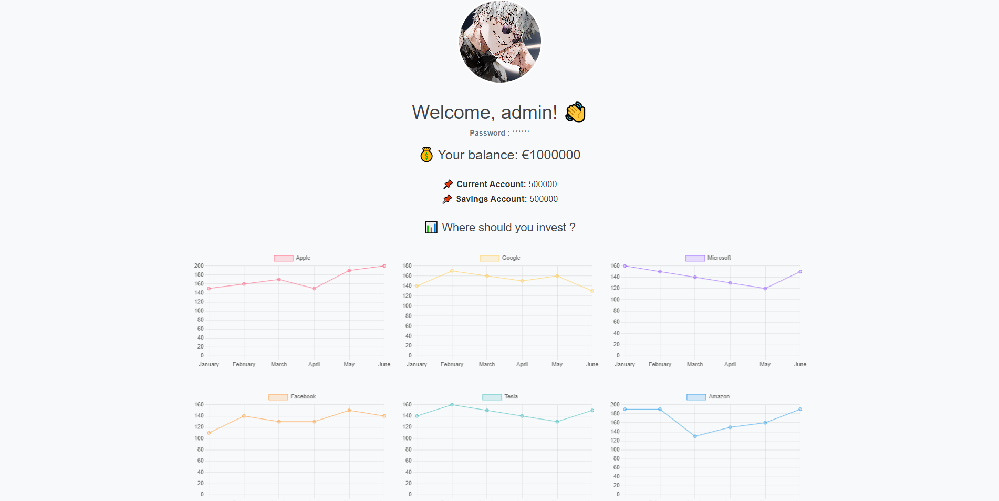
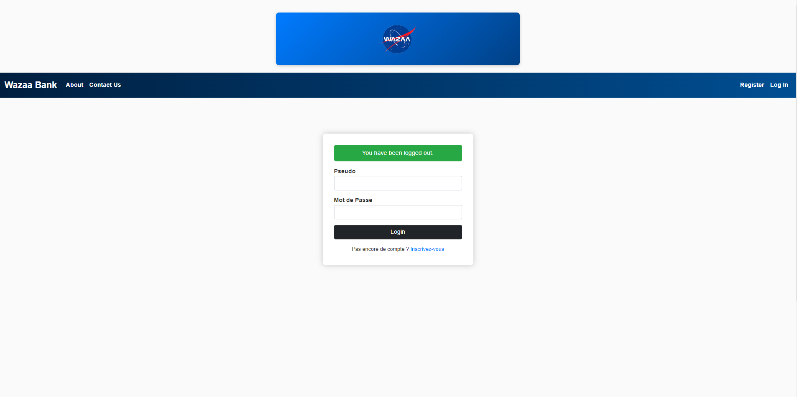

# 🏦 Wazaa Bank

Wazaa Bank est une plateforme bancaire web développée dans le cadre d'un projet académique. Initialement conçue comme une application Flask monolithique, elle a ensuite été entièrement refactorisée vers une architecture **microservices**, conteneurisée avec **Docker** et orchestrée via **Docker Compose**.

## 🚀 Fonctionnalités

### 👤 Gestion des utilisateurs

* Inscription sécurisée
* Authentification utilisateur
* Gestion des sessions
* Profils utilisateurs

### 💰 Services bancaires

* Consultation du solde
* Gestion des comptes bancaires
* Historique des opérations
* Interface d'administration

### 🎨 Interface utilisateur

* Frontend React moderne
* Navigation dynamique
* Design responsive
* Gestion centralisée de l'authentification

### ⚙️ Architecture moderne

* Architecture Microservices
* API REST
* Base de données PostgreSQL
* Reverse Proxy Nginx
* Conteneurisation Docker

---

# 🏗️ Architecture du projet

```text
                 ┌─────────────┐
                 │    Nginx    │
                 │ ReverseProxy│
                 └──────┬──────┘
                        │
        ┌───────────────┼───────────────┐
        │               │               │
        ▼               ▼               ▼

 ┌───────────┐   ┌────────────┐   ┌────────────┐
 │ Frontend  │   │ Auth API   │   │ Bank API   │
 │  React    │   │   Flask    │   │   Flask    │
 └───────────┘   └─────┬──────┘   └─────┬──────┘
                       │                │
                       ▼                ▼

                 ┌──────────┐    ┌──────────┐
                 │PostgreSQL│    │PostgreSQL│
                 │ Auth DB  │    │ Bank DB  │
                 └──────────┘    └──────────┘
```

---

# 📁 Structure du projet

```text
.
├── auth-service/
│   ├── app.py
│   ├── Dockerfile
│   ├── init.sql
│   └── src/
│
├── bank-service/
│   ├── app.py
│   ├── Dockerfile
│   ├── init.sql
│   └── src/
│
├── frontend/
│   ├── Dockerfile
│   ├── public/
│   └── src/
│
├── proxy/
│   ├── Dockerfile
│   └── nginx.conf
│
├── docker-compose.yml
└── .gitlab-ci.yml
```

---

# 🛠️ Technologies utilisées

### Backend

* Python 3.10
* Flask
* PostgreSQL
* SQLAlchemy

### Frontend

* React.js
* React Router
* Context API

### Infrastructure

* Docker
* Docker Compose
* Nginx

### CI/CD

* GitLab CI

---

# 🐳 Lancement avec Docker

## Prérequis

* Docker
* Docker Compose

Vérifier les installations :

```bash
docker --version
docker compose version
```

---

## Cloner le projet

```bash
git clone https://github.com/marwanbns/WazaaaBank.git

cd WazaaaBank
```

---

## Construire les conteneurs

```bash
docker compose build
```

---

## Démarrer l'application

```bash
docker compose up -d
```

---

## Vérifier les conteneurs

```bash
docker ps
```

Vous devriez voir :

* frontend
* auth-service
* bank-service
* auth-db
* bank-db
* proxy

---

# 🌐 Accès aux services

| Service         | URL                   |
| --------------- | --------------------- |
| Application Web | http://localhost      |
| Frontend React  | http://localhost:3000 |
| Auth Service    | http://localhost:5000 |
| Bank Service    | http://localhost:5001 |

---

# 🗄️ Bases de données

## Auth Database

```env
POSTGRES_USER=auth_user
POSTGRES_PASSWORD=auth_password
POSTGRES_DB=auth_db
```

## Bank Database

```env
POSTGRES_USER=bank_user
POSTGRES_PASSWORD=bank_password
POSTGRES_DB=bank_db
```

---

# 🔒 Réseau Docker

L'application est séparée en trois réseaux Docker :

* `frontend-net`
* `auth-net`
* `bank-net`

Cette séparation améliore l'isolation et la sécurité entre les services.

---

# 🔄 CI/CD

Le projet inclut un pipeline GitLab CI permettant :

* Build automatique
* Tests automatisés
* Déploiement des conteneurs

Configuration disponible dans :

```text
.gitlab-ci.yml
```

---

# 📸 Captures d'écran

L'interface conserve les fonctionnalités principales de la première version :

* Accueil
* Authentification
* Gestion des comptes
* Administration
* Contact

---

# 👨‍💻 Dev

Développé par :

* Marwan Bns

---

# 📈 Évolution du projet

### Version 1

* Flask Monolithique
* Stockage CSV
* Templates Jinja2
* Authentification locale

### Version 2

* Architecture Microservices
* React Frontend
* PostgreSQL
* Docker & Docker Compose
* Reverse Proxy Nginx
* CI/CD GitLab

---

# Screenshots








---

# 📄 Licence

Ce projet est distribué sous licence MIT.

Voir le fichier :

```text
LICENSE
```